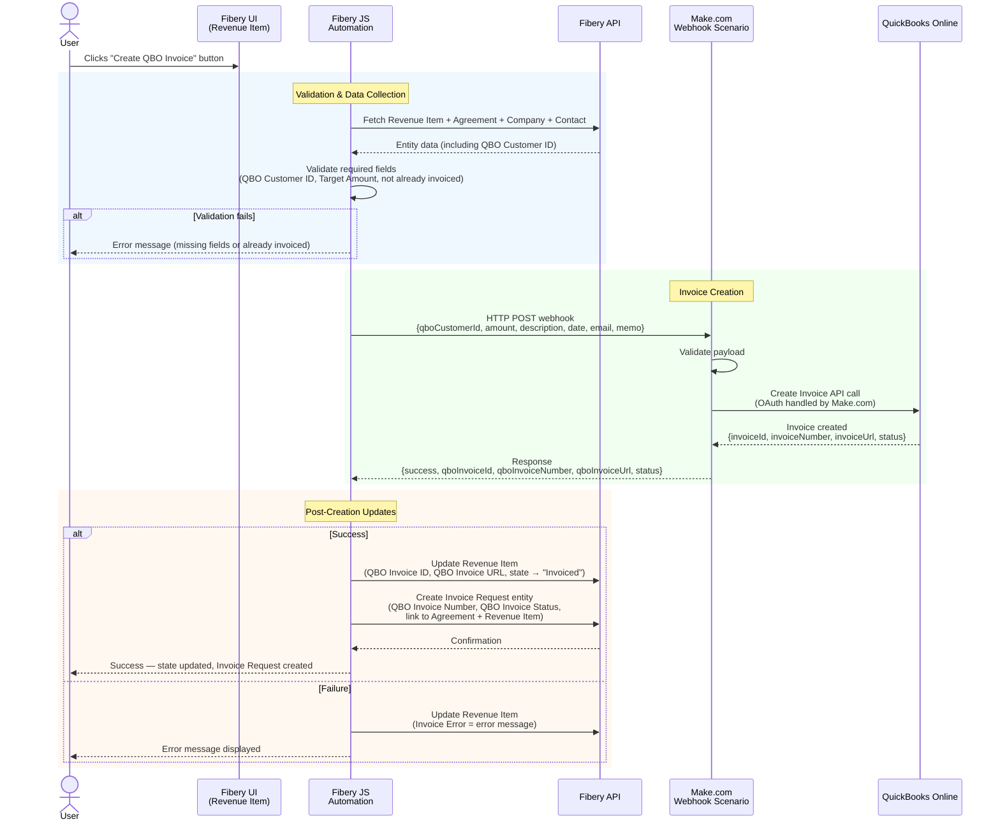

# Fibery → QuickBooks Online Invoice Integration — PRD

## Change Log

| Version | Date | Author | Changes |
|---|---|---|---|
| 0.1 | 2026-03-31 | Bernard + Claude | Initial draft — architecture, data mapping, schema changes, user flow, phased implementation plan, open questions |
| 0.2 | 2026-03-31 | Bernard + Claude | Resolved all Section 11 open questions; added Decisions section; updated schema (fields created in Fibery); Invoice Request entity now part of core flow; updated user flow and requirements |
| 0.3 | 2026-03-31 | Bernard + Claude | Added Mermaid sequence diagram showing full interaction flow: validation, Make.com webhook, QBO invoice creation, Fibery updates (success & error paths) |
| 0.4 | 2026-03-31 | Bernard + Claude | Added [Implementation Plan](IMPLEMENTATION-PLAN.md) with task-level traceability to PRD sections, versions, and priorities; dependency graph; progress tracking |
| 0.5 | 2026-03-31 | Bernard + Claude | Resolved 3 of 4 open questions: QBO Item ID = 3, Invoice Request naming = "INV - {Revenue Milestone Name}", QBO Customer IDs loaded. Realm ID pending. |
| 0.6 | 2026-03-31 | Bernard + Claude | All open questions resolved. QBO Realm ID = 9130354334258356. Phase 1 unblocked — ready for Make.com scenario build. |
| 0.7 | 2026-03-31 | Bernard + Claude | Make.com scenario created (ID: 4590134): Custom Webhook → QBO CreateInvoice → WebhookRespond. Webhook URL live. QBO OAuth connection pending user auth. |

---

## 1. Overview

Enable users to create a QuickBooks Online (QBO) invoice directly from a **Revenue Item** (Revenue Milestone) in Fibery's Agreement Management space by clicking a Button. The button triggers a JavaScript automation that sends the relevant data to QBO via a Make.com webhook, which handles OAuth and invoice creation.

## 2. Problem Statement

Currently, when a Revenue Milestone is ready to be invoiced, users must manually re-enter invoice details into QuickBooks Online. This is error-prone, time-consuming, and creates a disconnect between the agreement management system (Fibery) and the accounting system (QBO).

## 3. Goals

- **One-click invoicing**: User clicks a button on a Revenue Item → invoice appears in QBO
- **Data accuracy**: Invoice fields populated directly from Fibery data — no manual re-entry
- **Status tracking**: Revenue Item workflow state updates to reflect invoicing status
- **Simplicity**: Minimal moving parts; leverage existing Make.com integration for QBO auth

## 4. Architecture

```
┌─────────────────────┐     HTTP POST      ┌─────────────┐    QBO API     ┌─────────┐
│  Fibery Button      │ ──────────────────► │  Make.com   │ ────────────► │  QBO    │
│  (JS Automation)    │   (webhook + JSON)  │  Scenario   │               │ Invoice │
│  on Revenue Item    │ ◄────────────────── │             │               │         │
└─────────────────────┘    response/status  └─────────────┘               └─────────┘
```

### Why Make.com as middleware?
- **OAuth 2.0 management**: QBO requires OAuth with token refresh — Make.com handles this natively via its QBO connector
- **Already in use**: Make.com is already connected to this workspace
- **Error handling & logging**: Make.com provides execution history, retry, and error notifications
- **No infrastructure to manage**: No servers, no deployments

### Alternative considered: Direct QBO API from Fibery JS
- Rejected: Fibery's JS automation environment cannot securely store/refresh OAuth tokens, and has limited HTTP capabilities for the full QBO auth flow

### Sequence Diagram



## 5. Data Mapping — Fibery → QBO Invoice

### Source: Revenue Item (and related entities)

| Fibery Field | Source | QBO Invoice Field | Notes |
|---|---|---|---|
| `Agreement.Customer.Name` | Company name via Agreement | `CustomerRef` | Must match an existing QBO Customer (or create) |
| `Milestone Title` | Revenue Item | `Line[0].Description` | Invoice line item description |
| `Target Amount` | Revenue Item | `Line[0].Amount` | Invoice line item amount |
| `Target Date` | Revenue Item | `TxnDate` | Invoice date |
| `Agreement.Name` | Agreement | `CustomField` or `PrivateNote` | Reference back to the agreement |
| `Revenue Item.Name` | Revenue Item (formula) | `Line[0].Description` prefix | Full context: "Agreement - Milestone" |
| `Agreement.Contact.Email` | Contact via Agreement | `BillEmail` | Invoice delivery email |

### Resolved Data Mapping Decisions
- **QBO Customer matching**: Match by `QBO Customer ID` stored on the Fibery Company entity. User will manually populate IDs from QBO. Field is required for invoicing.
- **QBO Item/Service**: Use a generic QBO Item/Service. The line item description will reflect the Revenue Item Name (formula: "Agreement - Milestone Title").
- **Tax & Payment Terms**: Use QBO global defaults — no per-agreement configuration needed.
- **Invoice numbering**: Let QBO auto-number.
- **Multiple line items**: 1:1 — each Revenue Item creates one invoice with one line item.

## 6. User Flow

### Happy Path
1. User navigates to a Revenue Item in Fibery
2. User clicks **"Create QBO Invoice"** button
3. Fibery JS automation:
   a. Validates required fields are populated (Customer, QBO Customer ID, Target Amount, etc.)
   b. Collects data from Revenue Item + related Agreement + Company + Contact
   c. POSTs JSON payload to Make.com webhook URL
   d. Receives response (success + QBO Invoice ID + Invoice Number)
   e. **Creates an Invoice Request** entity linked to the Agreement and Revenue Item
   f. Stores QBO Invoice Number and QBO Invoice Status on the Invoice Request
   g. Stores QBO Invoice ID and QBO Invoice URL on the Revenue Item
   h. Updates Revenue Item workflow state → **"Invoice Requested"** → **"Invoiced"**
4. User sees confirmation (state change on Revenue Item + linked Invoice Request created)

### Error Scenarios
- **Missing required fields** → Button shows validation error before sending
- **QBO Customer not found** → Make.com returns error; Fibery shows message to user
- **Duplicate invoice** → Guard against double-click / re-invoicing already-invoiced items
- **Make.com / QBO down** → Graceful error message; user can retry

## 7. Fibery Schema Changes

All fields below have been **created in Fibery** as of v0.2.

| Status | Database | Field | Type | Purpose |
|---|---|---|---|---|
| DONE | Companies | `QBO Customer ID` | Text | QBO Customer ID — user-populated from QBO |
| DONE | Revenue Item | `QBO Invoice ID` | Text | QBO Invoice ID returned after creation |
| DONE | Revenue Item | `QBO Invoice URL` | Text (URL) | Deep link to invoice in QBO |
| DONE | Revenue Item | `Invoice Error` | Text | Last error message if creation failed |
| DONE | Invoice Requests | `QBO Invoice Number` | Text | Invoice number from QBO |
| DONE | Invoice Requests | `QBO Invoice Status` | Text | Current invoice status from QBO |
| Existing | Revenue Item | `workflow/state` | Workflow | Use existing "Invoiced" / "Invoice Requested" states |
| TODO | Revenue Item | "Create QBO Invoice" | Button | Triggers the JS automation |

## 8. Make.com Scenario Design

### Webhook Trigger
- Custom webhook endpoint
- Receives JSON payload with all invoice data

### Scenario Steps
1. **Webhook** — receive payload
2. **Validate payload** — check required fields present
3. **Create QBO Invoice** — using `QBO Customer ID` from payload, generic line item, global default terms/tax
4. **Return response** — QBO Invoice ID, Invoice Number, Invoice URL, and status back to Fibery

### Payload Schema (Fibery → Make.com)

```json
{
  "fiberyRevenueItemId": "uuid",
  "fiberyAgreementId": "uuid",
  "customerName": "Acme Corp",
  "qboCustomerId": "123",
  "milestoneTitle": "Phase 1 Delivery",
  "revenueItemName": "Acme Consulting - Phase 1 Delivery",
  "amount": 25000.00,
  "invoiceDate": "2026-03-31",
  "agreementName": "Acme Consulting",
  "contactEmail": "billing@acme.com",
  "memo": "Agreement: Acme Consulting | Milestone: Phase 1 Delivery"
}
```

### Response Schema (Make.com → Fibery)

```json
{
  "success": true,
  "qboInvoiceId": "456",
  "qboInvoiceNumber": "INV-1042",
  "qboInvoiceUrl": "https://app.qbo.intuit.com/...",
  "qboInvoiceStatus": "Open",
  "error": null
}
```

## 9. Fibery JavaScript Automation (Button Script)

### Responsibilities
- Fetch Revenue Item + related Agreement + Company + Contact data via Fibery API
- Validate required fields
- POST to Make.com webhook
- Handle response (update state, store QBO ID, or show error)

### Technical Constraints
- Fibery JS automations run in a sandboxed environment
- `fetch()` / `http` available for outbound HTTP calls
- Can read/write entity fields via the Fibery API context
- Limited execution time (timeout ~30s)

## 10. Requirements Checklist

### Must Have (P0)
- [ ] Button on Revenue Item triggers invoice creation in QBO
- [ ] Invoice populated with: Customer (by QBO Customer ID), Amount, Description (Revenue Item Name), Date
- [ ] Revenue Item state updated to "Invoiced" on success
- [ ] QBO Invoice ID stored on Revenue Item
- [ ] **Invoice Request entity created** with QBO Invoice Number and QBO Invoice Status
- [ ] Invoice Request linked to Agreement and Revenue Item
- [ ] Validation prevents invoicing without required data (QBO Customer ID, Target Amount)
- [ ] Guard against duplicate invoice creation (don't re-invoice "Invoiced" items)
- [ ] QBO uses global default tax and payment terms

### Should Have (P1)
- [ ] Error message stored on Revenue Item `Invoice Error` field when creation fails
- [ ] QBO Invoice URL stored on Revenue Item for quick navigation
- [ ] Contact email passed as BillEmail on the QBO invoice
- [ ] Agreement name included in invoice memo/private note

### Nice to Have (P2)
- [ ] Batch invoicing: select multiple Revenue Items → create multiple invoices
- [ ] Auto-create QBO Customer if not found
- [ ] Invoice PDF attached back to Revenue Item in Fibery
- [ ] Slack notification on successful invoice creation
- [ ] Support for multiple line items per invoice (multiple Revenue Items → one invoice)

## 11. Decisions Log

| # | Question | Decision | Date |
|---|---|---|---|
| 1 | QBO Customer Matching Strategy | Match by `QBO Customer ID` stored on Fibery Company. User will manually populate IDs from QBO. | 2026-03-31 |
| 2 | QBO Item/Service for line items | Generic QBO Item/Service. Line description = Revenue Item Name (Agreement - Milestone Title). | 2026-03-31 |
| 3 | Tax & Payment Terms | Use QBO global defaults. No per-agreement configuration. | 2026-03-31 |
| 4 | Invoice Request workflow | Button creates an Invoice Request entity linked to Agreement & Revenue Item. Stores QBO Invoice Number and Status. | 2026-03-31 |
| 5 | Who can click the button? | Any authorized Fibery user. No additional role restrictions. | 2026-03-31 |
| 6 | QBO Sandbox for testing? | No sandbox available. Will test against production QBO with care. | 2026-03-31 |
| 7 | Make.com plan limits | No concerns — sufficient quota. | 2026-03-31 |
| 8 | Generic QBO Item/Service | Use QBO Item ID `3`. | 2026-03-31 |
| 9 | Invoice Request naming | Prefix "INV" + Revenue Milestone Name (e.g., "INV - Acme Consulting - Phase 1 Delivery"). | 2026-03-31 |
| 10 | QBO Customer IDs | Loaded into Fibery Company entities by user. | 2026-03-31 |
| 11 | QBO Realm ID | `9130354334258356` | 2026-03-31 |

## 12. Remaining Open Questions

- [x] **Generic QBO Item/Service name** — **Resolved**: Use QBO Item ID `3`
- [x] **QBO Company ID** — **Resolved**: Realm ID `9130354334258356`
- [x] **Invoice Request naming convention** — **Resolved**: Prefix "INV" + Revenue Milestone Name (e.g., "INV - Acme Consulting - Phase 1 Delivery")

## 13. Implementation Phases

### Phase 1: Foundation (DONE)
- [x] Add new fields to Fibery schema (QBO Customer ID, QBO Invoice ID, QBO Invoice URL, Invoice Error, QBO Invoice Number, QBO Invoice Status)
- [ ] Populate QBO Customer IDs on existing Fibery Companies
- [ ] Set up Make.com scenario with QBO connection
- [ ] Build & test webhook payload/response contract

### Phase 2: Core Integration
- [ ] Write Fibery JS automation (button script)
- [ ] Wire up Make.com scenario to create QBO invoice
- [ ] Create Invoice Request entity in automation flow
- [ ] Test end-to-end against production QBO

### Phase 3: Polish & Guardrails
- [ ] Add validation & error handling
- [ ] Duplicate prevention logic
- [ ] Store QBO Invoice URL, update workflow states
- [ ] User testing & feedback

### Phase 4: Enhancements (P1/P2 items)
- [ ] Batch invoicing
- [ ] Auto-create QBO customers
- [ ] Slack notifications
- [ ] Invoice PDF attachment
