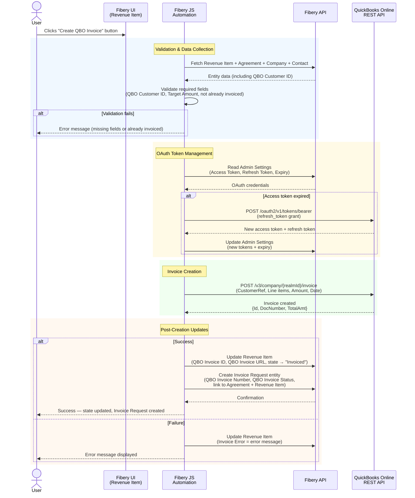

# Fibery → QuickBooks Online Invoice Integration — PRD

## Change Log

| Version | Date | Author | Changes |
|---|---|---|---|
| 0.1 | 2026-03-31 | Bernard + Claude | Initial draft — architecture, data mapping, schema changes, user flow, phased implementation plan, open questions |
| 0.2 | 2026-03-31 | Bernard + Claude | Resolved all Section 11 open questions; added Decisions section; updated schema (fields created in Fibery); Invoice Request entity now part of core flow; updated user flow and requirements |
| 0.3 | 2026-03-31 | Bernard + Claude | Added Mermaid sequence diagram showing full interaction flow: validation, Make.com webhook, QBO invoice creation, Fibery updates (success & error paths) |
| 0.4 | 2026-03-31 | Bernard + Claude | Added [Implementation Plan](IMPLEMENTATION-PLAN.md) with task-level traceability to PRD sections, versions, and priorities; dependency graph; progress tracking |
| 0.5 | 2026-03-31 | Bernard + Claude | Resolved 3 of 4 open questions: QBO Item ID = 3, Invoice Request naming = "INV - {Revenue Milestone Name}", QBO Customer IDs loaded. Realm ID pending. |
| 0.6 | 2026-03-31 | Bernard + Claude | All open questions resolved. QBO Realm ID = 9130354334258356. Phase 1 unblocked — ready for Make.com scenario build. |
| 0.7 | 2026-03-31 | Bernard + Claude | Make.com scenario created (ID: 4590134): Custom Webhook → QBO CreateInvoice → WebhookRespond. Webhook URL live. QBO OAuth connection pending user auth. |
| 0.8 | 2026-03-31 | Bernard + Claude | **Architecture pivot**: Replaced Make.com with direct QBO API calls from Fibery JS (Option C). Client requires developer-level QBO access only — Make.com's native connector requires admin. OAuth tokens stored in Admin Settings. Make.com scenario deprecated. |

---

## 1. Overview

Enable users to create a QuickBooks Online (QBO) invoice directly from a **Revenue Item** (Revenue Milestone) in Fibery's Agreement Management space by clicking a Button. The button triggers a JavaScript automation that calls the QBO API directly, handling OAuth token management and invoice creation within Fibery.

## 2. Problem Statement

Currently, when a Revenue Milestone is ready to be invoiced, users must manually re-enter invoice details into QuickBooks Online. This is error-prone, time-consuming, and creates a disconnect between the agreement management system (Fibery) and the accounting system (QBO).

## 3. Goals

- **One-click invoicing**: User clicks a button on a Revenue Item → invoice appears in QBO
- **Data accuracy**: Invoice fields populated directly from Fibery data — no manual re-entry
- **Status tracking**: Revenue Item workflow state updates to reflect invoicing status
- **Simplicity**: Minimal moving parts — single Fibery JS automation calls QBO API directly

## 4. Architecture

```
┌─────────────────────┐                          ┌─────────────────┐
│  Fibery Button      │    QBO REST API           │  QuickBooks     │
│  (JS Automation)    │ ────────────────────────► │  Online         │
│  on Revenue Item    │ ◄──────────────────────── │  Invoice        │
│                     │    (OAuth2 + JSON)         │                 │
│  • Reads Admin      │                            └─────────────────┘
│    Settings for     │
│    OAuth tokens     │
│  • Refreshes token  │
│    if expired       │
│  • Updates Fibery   │
│    entities on      │
│    completion       │
└─────────────────────┘
```

**Single moving part**: The Fibery JS button automation handles everything — OAuth token management, QBO API calls, and Fibery entity updates.

### Why direct API from Fibery JS?
- **Simplest architecture**: One component, no middleware, no external services to manage
- **Client constraint**: Client grants developer-level QBO access only — Make.com's native QBO connector requires admin-level OAuth
- **Sufficient runtime**: Fibery JS has `fetch()` for HTTP calls and ~30s timeout — more than enough for a single invoice creation
- **OAuth tokens stored in Admin Settings**: Same pattern already used for Clockify and OpenAI API keys

### Alternatives considered and rejected
- **Make.com with native QBO connector** (v0.1–v0.7): Rejected — requires admin-level QBO access the client won't grant
- **Make.com with HTTP module**: Would work but adds unnecessary middleware when Fibery JS can call QBO directly
- **Google Apps Script**: Solid option but adds another moving part; no advantage over Fibery JS for this use case
- **AWS Lambda / Cloudflare Worker**: Overkill for occasional invoice creation

### OAuth Token Flow

The Fibery JS automation manages QBO OAuth tokens stored in the `Admin Settings` entity:

1. **One-time setup**: Register app on developer.intuit.com → complete OAuth consent flow → store initial refresh token in Admin Settings
2. **On each button click**: Script reads tokens from Admin Settings → checks expiry → refreshes if needed → calls QBO API
3. **Token refresh**: Access tokens expire every ~60 min. The script uses the refresh token to obtain a new access token and updates Admin Settings automatically. Refresh tokens are valid for 100 days.

### Sequence Diagram



## 5. Data Mapping — Fibery → QBO Invoice

### Source: Revenue Item (and related entities)

| Fibery Field | Source | QBO Invoice Field | Notes |
|---|---|---|---|
| `Agreement.Customer.Name` | Company name via Agreement | `CustomerRef` | Must match an existing QBO Customer (or create) |
| `Milestone Title` | Revenue Item | `Line[0].Description` | Invoice line item description |
| `Target Amount` | Revenue Item | `Line[0].Amount` | Invoice line item amount |
| `Target Date` | Revenue Item | `TxnDate` | Invoice date |
| `Agreement.Name` | Agreement | `CustomField` or `PrivateNote` | Reference back to the agreement |
| `Revenue Item.Name` | Revenue Item (formula) | `Line[0].Description` prefix | Full context: "Agreement - Milestone" |
| `Agreement.Contact.Email` | Contact via Agreement | `BillEmail` | Invoice delivery email |

### Resolved Data Mapping Decisions
- **QBO Customer matching**: Match by `QBO Customer ID` stored on the Fibery Company entity. User will manually populate IDs from QBO. Field is required for invoicing.
- **QBO Item/Service**: Use a generic QBO Item/Service. The line item description will reflect the Revenue Item Name (formula: "Agreement - Milestone Title").
- **Tax & Payment Terms**: Use QBO global defaults — no per-agreement configuration needed.
- **Invoice numbering**: Let QBO auto-number.
- **Multiple line items**: 1:1 — each Revenue Item creates one invoice with one line item.

## 6. User Flow

### Happy Path
1. User navigates to a Revenue Item in Fibery
2. User clicks **"Create QBO Invoice"** button
3. Fibery JS automation:
   a. Validates required fields are populated (Customer, QBO Customer ID, Target Amount, etc.)
   b. Collects data from Revenue Item + related Agreement + Company + Contact
   c. Reads OAuth tokens from Admin Settings; refreshes access token if expired
   d. Calls QBO REST API to create invoice
   e. Receives response (QBO Invoice ID, DocNumber, etc.)
   f. **Creates an Invoice Request** entity linked to the Agreement and Revenue Item
   g. Stores QBO Invoice Number and QBO Invoice Status on the Invoice Request
   h. Stores QBO Invoice ID and QBO Invoice URL on the Revenue Item
   i. Updates Revenue Item workflow state → **"Invoiced"**
4. User sees confirmation (state change on Revenue Item + linked Invoice Request created)

### Error Scenarios
- **Missing required fields** → Button shows validation error before calling QBO
- **QBO Customer not found** → QBO API returns error; stored in Invoice Error field
- **Duplicate invoice** → Guard against double-click / re-invoicing already-invoiced items
- **Token expired and refresh fails** → Error message; admin must re-authorize via Intuit Developer Portal
- **QBO API down** → Graceful error message; user can retry

## 7. Fibery Schema Changes

All fields below have been **created in Fibery** as of v0.2.

| Status | Database | Field | Type | Purpose |
|---|---|---|---|---|
| DONE | Companies | `QBO Customer ID` | Text | QBO Customer ID — user-populated from QBO |
| DONE | Revenue Item | `QBO Invoice ID` | Text | QBO Invoice ID returned after creation |
| DONE | Revenue Item | `QBO Invoice URL` | Text (URL) | Deep link to invoice in QBO |
| DONE | Revenue Item | `Invoice Error` | Text | Last error message if creation failed |
| DONE | Invoice Requests | `QBO Invoice Number` | Text | Invoice number from QBO |
| DONE | Invoice Requests | `QBO Invoice Status` | Text | Current invoice status from QBO |
| Existing | Revenue Item | `workflow/state` | Workflow | Use existing "Invoiced" / "Invoice Requested" states |
| TODO | Revenue Item | "Create QBO Invoice" | Button | Triggers the JS automation |
| DONE | Admin Settings | `QBO Client ID` | Text | Intuit Developer App Client ID |
| DONE | Admin Settings | `QBO Client Secret` | Text | Intuit Developer App Client Secret |
| DONE | Admin Settings | `QBO Refresh Token` | Text | OAuth refresh token (valid 100 days) |
| DONE | Admin Settings | `QBO Access Token` | Text | OAuth access token (expires ~60 min) |
| DONE | Admin Settings | `QBO Token Expiry` | Date-Time | When the current access token expires |
| DONE | Admin Settings | `QBO Realm ID` | Text | QBO Company ID for API calls |

## 8. QBO API Integration (Direct from Fibery JS)

> **Note**: This section replaces the previous Make.com Scenario Design (v0.1–v0.7). Make.com was removed due to client constraint requiring developer-level QBO access only.

### Intuit Developer App Setup (One-Time)
1. Register an app at [developer.intuit.com](https://developer.intuit.com)
2. Set redirect URI (can use Intuit's OAuth Playground for initial token exchange)
3. Request scope: `com.intuit.quickbooks.accounting`
4. Complete OAuth consent flow → obtain initial refresh token
5. Store Client ID, Client Secret, Refresh Token, and Realm ID in Fibery Admin Settings

### QBO REST API — Create Invoice Endpoint

```
POST https://quickbooks.api.intuit.com/v3/company/{realmId}/invoice
Content-Type: application/json
Authorization: Bearer {accessToken}
Accept: application/json
```

### Request Body (constructed by Fibery JS)

```json
{
  "CustomerRef": { "value": "123" },
  "Line": [
    {
      "Amount": 25000.00,
      "DetailType": "SalesItemLineDetail",
      "SalesItemLineDetail": {
        "ItemRef": { "value": "3" },
        "Qty": 1,
        "UnitPrice": 25000.00,
        "ServiceDate": "2026-03-31"
      },
      "Description": "Acme Consulting - Phase 1 Delivery"
    }
  ],
  "TxnDate": "2026-03-31",
  "BillEmail": { "Address": "billing@acme.com" },
  "PrivateNote": "Agreement: Acme Consulting | Milestone: Phase 1 Delivery"
}
```

### Response Fields Used

| QBO Response Field | Stored In | Fibery Field |
|---|---|---|
| `Id` | Revenue Item | `QBO Invoice ID` |
| `DocNumber` | Invoice Request | `QBO Invoice Number` |
| Constructed URL | Revenue Item | `QBO Invoice URL` |
| `"Open"` (default) | Invoice Request | `QBO Invoice Status` |

### Token Refresh Flow

```
POST https://oauth.platform.intuit.com/oauth2/v1/tokens/bearer
Content-Type: application/x-www-form-urlencoded

grant_type=refresh_token
&refresh_token={refreshToken}
&client_id={clientId}
&client_secret={clientSecret}
```

Returns new `access_token`, `refresh_token`, and `expires_in`. Script updates Admin Settings with new values.

## 9. Fibery JavaScript Automation (Button Script)

### Responsibilities
1. Fetch Revenue Item + related Agreement + Company + Contact data via Fibery API
2. Validate required fields (QBO Customer ID, Target Amount, not already invoiced)
3. Read OAuth tokens from Admin Settings
4. Refresh access token if expired
5. Call QBO REST API to create invoice
6. Create Invoice Request entity in Fibery
7. Update Revenue Item with QBO Invoice ID, URL, and workflow state
8. Handle errors (store in Invoice Error field)

### Technical Constraints
- Fibery JS automations run in a sandboxed environment
- `fetch()` / `http` available for outbound HTTP calls
- Can read/write entity fields via the Fibery API context
- Limited execution time (timeout ~30s — sufficient for token refresh + one API call)

## 10. Requirements Checklist

### Must Have (P0)
- [ ] Button on Revenue Item triggers invoice creation in QBO
- [ ] Invoice populated with: Customer (by QBO Customer ID), Amount, Description (Revenue Item Name), Date
- [ ] Revenue Item state updated to "Invoiced" on success
- [ ] QBO Invoice ID stored on Revenue Item
- [ ] **Invoice Request entity created** with QBO Invoice Number and QBO Invoice Status
- [ ] Invoice Request linked to Agreement and Revenue Item
- [ ] Validation prevents invoicing without required data (QBO Customer ID, Target Amount)
- [ ] Guard against duplicate invoice creation (don't re-invoice "Invoiced" items)
- [ ] QBO uses global default tax and payment terms

### Should Have (P1)
- [ ] Error message stored on Revenue Item `Invoice Error` field when creation fails
- [ ] QBO Invoice URL stored on Revenue Item for quick navigation
- [ ] Contact email passed as BillEmail on the QBO invoice
- [ ] Agreement name included in invoice memo/private note

### Nice to Have (P2)
- [ ] Batch invoicing: select multiple Revenue Items → create multiple invoices
- [ ] Auto-create QBO Customer if not found
- [ ] Invoice PDF attached back to Revenue Item in Fibery
- [ ] Slack notification on successful invoice creation
- [ ] Support for multiple line items per invoice (multiple Revenue Items → one invoice)

## 11. Decisions Log

| # | Question | Decision | Date |
|---|---|---|---|
| 1 | QBO Customer Matching Strategy | Match by `QBO Customer ID` stored on Fibery Company. User will manually populate IDs from QBO. | 2026-03-31 |
| 2 | QBO Item/Service for line items | Generic QBO Item/Service. Line description = Revenue Item Name (Agreement - Milestone Title). | 2026-03-31 |
| 3 | Tax & Payment Terms | Use QBO global defaults. No per-agreement configuration. | 2026-03-31 |
| 4 | Invoice Request workflow | Button creates an Invoice Request entity linked to Agreement & Revenue Item. Stores QBO Invoice Number and Status. | 2026-03-31 |
| 5 | Who can click the button? | Any authorized Fibery user. No additional role restrictions. | 2026-03-31 |
| 6 | QBO Sandbox for testing? | No sandbox available. Will test against production QBO with care. | 2026-03-31 |
| 7 | Make.com plan limits | No concerns — sufficient quota. | 2026-03-31 |
| 8 | Generic QBO Item/Service | Use QBO Item ID `3`. | 2026-03-31 |
| 9 | Invoice Request naming | Prefix "INV" + Revenue Milestone Name (e.g., "INV - Acme Consulting - Phase 1 Delivery"). | 2026-03-31 |
| 10 | QBO Customer IDs | Loaded into Fibery Company entities by user. | 2026-03-31 |
| 11 | QBO Realm ID | `9130354334258356` | 2026-03-31 |
| 12 | Architecture approach | **Option C — Direct QBO API from Fibery JS**. Client grants developer-level access only; Make.com requires admin. Eliminates middleware entirely. | 2026-03-31 |
| 13 | OAuth token storage | Store in Fibery Admin Settings entity (same pattern as Clockify/OpenAI keys). | 2026-03-31 |

## 12. Remaining Open Questions

- [x] **Generic QBO Item/Service name** — **Resolved**: Use QBO Item ID `3`
- [x] **QBO Company ID** — **Resolved**: Realm ID `9130354334258356`
- [x] **Invoice Request naming convention** — **Resolved**: Prefix "INV" + Revenue Milestone Name (e.g., "INV - Acme Consulting - Phase 1 Delivery")

## 13. Implementation Phases

### Phase 1: Foundation
- [x] Add new fields to Fibery schema (QBO Customer ID, QBO Invoice ID, QBO Invoice URL, Invoice Error, QBO Invoice Number, QBO Invoice Status)
- [x] Populate QBO Customer IDs on existing Fibery Companies
- [x] Add OAuth fields to Admin Settings (QBO Client ID, Client Secret, Refresh Token, Access Token, Token Expiry, Realm ID)
- [ ] Register Intuit Developer app and complete initial OAuth consent flow
- [ ] Store OAuth credentials + Realm ID in Admin Settings entity
- ~~Set up Make.com scenario~~ *(deprecated — replaced by direct API)*

### Phase 2: Core Integration
- [ ] Write Fibery JS automation — OAuth token management (read, refresh, update)
- [ ] Write Fibery JS automation — QBO Create Invoice API call
- [ ] Write Fibery JS automation — data collection + validation
- [ ] Write Fibery JS automation — create Invoice Request entity
- [ ] Write Fibery JS automation — update Revenue Item fields + workflow state
- [ ] Create "Create QBO Invoice" button on Revenue Item
- [ ] Test end-to-end against production QBO

### Phase 3: Polish & Guardrails
- [ ] Validation guardrails (missing fields, duplicate prevention)
- [ ] Error handling (QBO errors, token expiry, network failures)
- [ ] Store error messages in Invoice Error field
- [ ] User acceptance testing

### Phase 4: Enhancements (P1/P2 items)
- [ ] Batch invoicing
- [ ] Auto-create QBO customers
- [ ] Slack notifications
- [ ] Invoice PDF attachment
