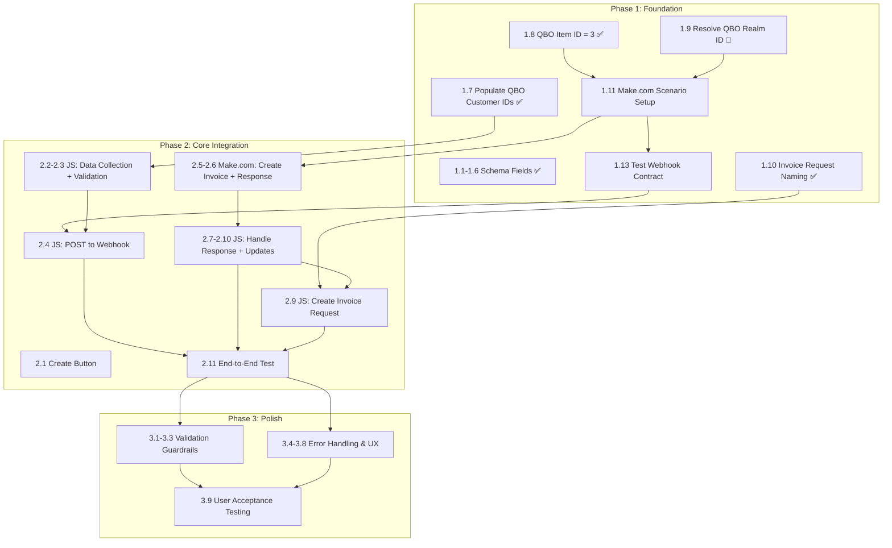

# Implementation Plan — Fibery → QBO Invoice Integration

> Aligned to [FiberyQBOIntegration-PRD.md](FiberyQBOIntegration-PRD.md). Each task traces back to a PRD section, requirement priority, and the PRD version where it was introduced or resolved.

## Status Legend

| Icon | Meaning |
|---|---|
| :white_check_mark: | Complete |
| :construction: | In Progress |
| :clipboard: | Not Started |
| :no_entry_sign: | Blocked |
| :bust_in_silhouette: | Requires User Action |

---

## Phase 1: Foundation

**Goal**: Establish the data model and integration plumbing before writing application logic.

| # | Task | Status | Owner | PRD Section | PRD Version | Priority | Notes |
|---|---|---|---|---|---|---|---|
| 1.1 | Create `QBO Customer ID` field on Companies | :white_check_mark: | Claude | 7. Schema Changes | v0.2 | P0 | Created in Fibery 2026-03-31 |
| 1.2 | Create `QBO Invoice ID` field on Revenue Item | :white_check_mark: | Claude | 7. Schema Changes | v0.2 | P0 | Created in Fibery 2026-03-31 |
| 1.3 | Create `QBO Invoice URL` field on Revenue Item | :white_check_mark: | Claude | 7. Schema Changes | v0.2 | P1 | Created in Fibery 2026-03-31 |
| 1.4 | Create `Invoice Error` field on Revenue Item | :white_check_mark: | Claude | 7. Schema Changes | v0.2 | P1 | Created in Fibery 2026-03-31 |
| 1.5 | Create `QBO Invoice Number` field on Invoice Requests | :white_check_mark: | Claude | 7. Schema Changes | v0.2 | P0 | Created in Fibery 2026-03-31 |
| 1.6 | Create `QBO Invoice Status` field on Invoice Requests | :white_check_mark: | Claude | 7. Schema Changes | v0.2 | P0 | Created in Fibery 2026-03-31 |
| 1.7 | Populate QBO Customer IDs on existing Fibery Companies | :white_check_mark: | Bernard | 5. Data Mapping | v0.2 | P0 | Completed 2026-03-31 |
| 1.8 | Resolve: Generic QBO Item/Service name/ID | :white_check_mark: | Bernard | 12. Open Questions | v0.2 | P0 | Resolved: QBO Item ID `3` |
| 1.9 | Resolve: QBO Company ID (realm ID) | :bust_in_silhouette: | Bernard | 12. Open Questions | v0.2 | P0 | User locating in QBO — found in URL `companyId` param |
| 1.10 | Resolve: Invoice Request naming convention | :white_check_mark: | Bernard | 12. Open Questions | v0.2 | P0 | Resolved: "INV - {Revenue Milestone Name}" |
| 1.11 | Create Make.com scenario with QBO connection | :clipboard: | Claude | 8. Make.com Scenario | v0.1 | P0 | Depends on 1.9 |
| 1.12 | Configure Make.com webhook endpoint | :clipboard: | Claude | 8. Make.com Scenario | v0.1 | P0 | Part of 1.11 |
| 1.13 | Define & test webhook payload/response contract | :clipboard: | Claude | 8. Payload/Response Schema | v0.2 | P0 | Test with sample POST before wiring to Fibery |
| 1.14 | Initialize GitHub repo + PRD | :white_check_mark: | Claude | — | v0.1 | — | github.com/bernardw01/FiberyQBOIntegration |
| 1.15 | Add README | :white_check_mark: | Claude | — | — | — | Links to PRD |

### Phase 1 Summary
- **Complete**: 11 of 15 tasks
- **Blocked on user input**: 1 remaining — QBO Realm ID (1.9)
- **Ready to start when unblocked**: Make.com scenario setup (1.11–1.13)

---

## Phase 2: Core Integration

**Goal**: Build the end-to-end flow — button click to QBO invoice creation to Fibery updates.

| # | Task | Status | Owner | PRD Section | PRD Version | Priority | Depends On |
|---|---|---|---|---|---|---|---|
| 2.1 | Create "Create QBO Invoice" button on Revenue Item | :clipboard: | Claude | 7. Schema Changes | v0.1 | P0 | — |
| 2.2 | Write Fibery JS automation — data collection | :clipboard: | Claude | 9. JS Automation | v0.1 | P0 | 1.7 |
| 2.3 | Write Fibery JS automation — field validation | :clipboard: | Claude | 9. JS Automation, 6. User Flow | v0.3 | P0 | 2.2 |
| 2.4 | Write Fibery JS automation — POST to Make.com webhook | :clipboard: | Claude | 9. JS Automation | v0.1 | P0 | 1.12, 2.3 |
| 2.5 | Wire Make.com scenario — QBO Create Invoice module | :clipboard: | Claude | 8. Make.com Scenario | v0.1 | P0 | 1.11, 1.8 |
| 2.6 | Wire Make.com scenario — return response to Fibery | :clipboard: | Claude | 8. Response Schema | v0.2 | P0 | 2.5 |
| 2.7 | Write Fibery JS automation — handle success response | :clipboard: | Claude | 6. User Flow (Happy Path) | v0.2 | P0 | 2.6 |
| 2.8 | Write Fibery JS automation — update Revenue Item fields | :clipboard: | Claude | 6. User Flow, 7. Schema | v0.2 | P0 | 2.7 |
| 2.9 | Write Fibery JS automation — create Invoice Request entity | :clipboard: | Claude | 6. User Flow, 11. Decisions (#4) | v0.2 | P0 | 1.10, 2.7 |
| 2.10 | Write Fibery JS automation — update workflow state | :clipboard: | Claude | 6. User Flow | v0.2 | P0 | 2.8 |
| 2.11 | End-to-end test against production QBO | :clipboard: | Bernard + Claude | 11. Decisions (#6) | v0.2 | P0 | All above |

### Phase 2 Summary
- **Complete**: 0 of 11 tasks
- **Blocked on**: Phase 1 completion (open questions + Make.com setup)

---

## Phase 3: Polish & Guardrails

**Goal**: Harden the integration — error handling, duplicate prevention, and user experience.

| # | Task | Status | Owner | PRD Section | PRD Version | Priority | Depends On |
|---|---|---|---|---|---|---|---|
| 3.1 | Add validation — prevent invoicing without QBO Customer ID | :clipboard: | Claude | 10. Requirements (P0) | v0.2 | P0 | 2.3 |
| 3.2 | Add validation — prevent invoicing without Target Amount | :clipboard: | Claude | 10. Requirements (P0) | v0.2 | P0 | 2.3 |
| 3.3 | Duplicate prevention — block re-invoicing "Invoiced" items | :clipboard: | Claude | 10. Requirements (P0), 6. Error Scenarios | v0.1 | P0 | 2.3 |
| 3.4 | Store error message in `Invoice Error` field on failure | :clipboard: | Claude | 10. Requirements (P1) | v0.2 | P1 | 2.7 |
| 3.5 | Store QBO Invoice URL on Revenue Item | :clipboard: | Claude | 10. Requirements (P1) | v0.2 | P1 | 2.7 |
| 3.6 | Pass Contact email as BillEmail on QBO invoice | :clipboard: | Claude | 10. Requirements (P1) | v0.1 | P1 | 2.5 |
| 3.7 | Include Agreement name in invoice memo/private note | :clipboard: | Claude | 10. Requirements (P1) | v0.1 | P1 | 2.5 |
| 3.8 | Handle Make.com / QBO downtime gracefully | :clipboard: | Claude | 6. Error Scenarios | v0.1 | P1 | 2.4 |
| 3.9 | User acceptance testing | :clipboard: | Bernard | — | — | P0 | All above |

### Phase 3 Summary
- **Complete**: 0 of 9 tasks
- **Note**: Tasks 3.1–3.3 (validations) will be built into the JS automation during Phase 2 but listed here for explicit acceptance testing

---

## Phase 4: Enhancements

**Goal**: Add P2 features based on user feedback and operational needs.

| # | Task | Status | Owner | PRD Section | PRD Version | Priority | Depends On |
|---|---|---|---|---|---|---|---|
| 4.1 | Batch invoicing — multiple Revenue Items at once | :clipboard: | TBD | 10. Requirements (P2) | v0.1 | P2 | Phase 3 |
| 4.2 | Auto-create QBO Customer if not found | :clipboard: | TBD | 10. Requirements (P2) | v0.1 | P2 | Phase 3 |
| 4.3 | Attach invoice PDF back to Revenue Item in Fibery | :clipboard: | TBD | 10. Requirements (P2) | v0.1 | P2 | Phase 3 |
| 4.4 | Slack notification on successful invoice creation | :clipboard: | TBD | 10. Requirements (P2) | v0.1 | P2 | Phase 3 |
| 4.5 | Multi-line invoices (multiple Revenue Items → one invoice) | :clipboard: | TBD | 10. Requirements (P2) | v0.1 | P2 | Phase 3 |

---

## Dependency Graph

---

## Overall Progress

| Phase | Total Tasks | Complete | In Progress | Blocked | Not Started |
|---|---|---|---|---|---|
| Phase 1: Foundation | 15 | 11 | 0 | 1 (user input) | 3 |
| Phase 2: Core Integration | 11 | 0 | 0 | 0 | 11 |
| Phase 3: Polish & Guardrails | 9 | 0 | 0 | 0 | 9 |
| Phase 4: Enhancements | 5 | 0 | 0 | 0 | 5 |
| **Total** | **40** | **11** | **0** | **1** | **28** |

### Current Blockers

| Blocker | Blocks | Action Needed |
|---|---|---|
| QBO Realm ID unknown | Make.com QBO connection (1.11) | Bernard: find in QBO URL → `companyId` parameter |

### Recently Resolved

| Item | Resolution | Date |
|---|---|---|
| QBO Customer IDs | Loaded into Fibery Company entities | 2026-03-31 |
| Generic QBO Item/Service | Item ID `3` | 2026-03-31 |
| Invoice Request naming | "INV - {Revenue Milestone Name}" | 2026-03-31 |
