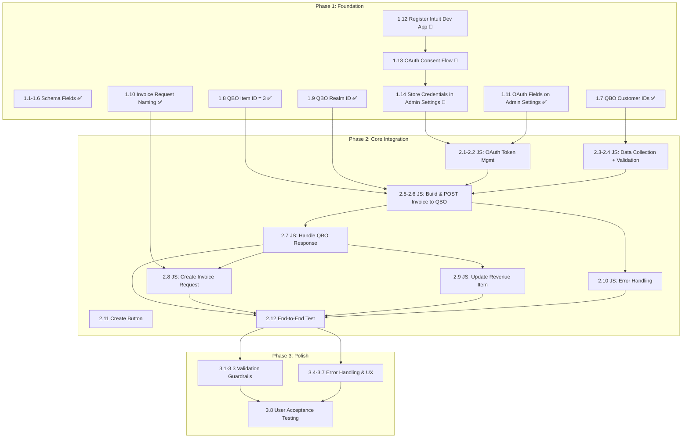

# Implementation Plan — Fibery → QBO Invoice Integration

> Aligned to [FiberyQBOIntegration-PRD.md](FiberyQBOIntegration-PRD.md). Each task traces back to a PRD section, requirement priority, and the PRD version where it was introduced or resolved.
>
> **Architecture (v0.8)**: Direct QBO API calls from Fibery JS automation. No middleware. OAuth tokens stored in Admin Settings.

## Status Legend

| Icon | Meaning |
|---|---|
| :white_check_mark: | Complete |
| :construction: | In Progress |
| :clipboard: | Not Started |
| :no_entry_sign: | Blocked |
| :bust_in_silhouette: | Requires User Action |
| :wastebasket: | Deprecated |

---

## Phase 1: Foundation

**Goal**: Establish the data model, resolve design decisions, and set up QBO OAuth credentials.

| # | Task | Status | Owner | PRD Section | PRD Version | Priority | Notes |
|---|---|---|---|---|---|---|---|
| 1.1 | Create `QBO Customer ID` field on Companies | :white_check_mark: | Claude | 7. Schema Changes | v0.2 | P0 | Created in Fibery 2026-03-31 |
| 1.2 | Create `QBO Invoice ID` field on Revenue Item | :white_check_mark: | Claude | 7. Schema Changes | v0.2 | P0 | Created in Fibery 2026-03-31 |
| 1.3 | Create `QBO Invoice URL` field on Revenue Item | :white_check_mark: | Claude | 7. Schema Changes | v0.2 | P1 | Created in Fibery 2026-03-31 |
| 1.4 | Create `Invoice Error` field on Revenue Item | :white_check_mark: | Claude | 7. Schema Changes | v0.2 | P1 | Created in Fibery 2026-03-31 |
| 1.5 | Create `QBO Invoice Number` field on Invoice Requests | :white_check_mark: | Claude | 7. Schema Changes | v0.2 | P0 | Created in Fibery 2026-03-31 |
| 1.6 | Create `QBO Invoice Status` field on Invoice Requests | :white_check_mark: | Claude | 7. Schema Changes | v0.2 | P0 | Created in Fibery 2026-03-31 |
| 1.7 | Populate QBO Customer IDs on existing Fibery Companies | :white_check_mark: | Bernard | 5. Data Mapping | v0.2 | P0 | Completed 2026-03-31 |
| 1.8 | Resolve: Generic QBO Item/Service name/ID | :white_check_mark: | Bernard | 12. Open Questions | v0.2 | P0 | Resolved: QBO Item ID `3` |
| 1.9 | Resolve: QBO Company ID (realm ID) | :white_check_mark: | Bernard | 12. Open Questions | v0.2 | P0 | Resolved: `9130354334258356` |
| 1.10 | Resolve: Invoice Request naming convention | :white_check_mark: | Bernard | 12. Open Questions | v0.2 | P0 | Resolved: "INV - {Revenue Milestone Name}" |
| 1.11 | Create OAuth fields on Admin Settings | :white_check_mark: | Claude | 7. Schema Changes | v0.8 | P0 | QBO Client ID, Client Secret, Refresh Token, Access Token, Token Expiry, Realm ID |
| 1.12 | Register Intuit Developer app | :bust_in_silhouette: | Bernard | 8. QBO API Integration | v0.8 | P0 | developer.intuit.com → create app → get Client ID + Secret |
| 1.13 | Complete initial OAuth consent flow | :bust_in_silhouette: | Bernard | 8. QBO API Integration | v0.8 | P0 | Use Intuit OAuth Playground → obtain initial refresh token |
| 1.14 | Store OAuth credentials in Admin Settings | :bust_in_silhouette: | Bernard | 8. QBO API Integration | v0.8 | P0 | Client ID, Client Secret, Refresh Token, Realm ID |
| 1.15 | Initialize GitHub repo + PRD + README | :white_check_mark: | Claude | — | v0.1 | — | github.com/bernardw01/FiberyQBOIntegration |
| ~~1.X~~ | ~~Create Make.com scenario~~ | :wastebasket: | — | — | v0.7→v0.8 | — | Deprecated: Make.com requires admin-level QBO access |
| ~~1.X~~ | ~~Configure Make.com webhook~~ | :wastebasket: | — | — | v0.7→v0.8 | — | Deprecated |

### Phase 1 Summary
- **Complete**: 12 of 15 active tasks
- **Remaining**: 3 tasks requiring user action (1.12–1.14: Intuit Developer app + OAuth)
- **Deprecated**: Make.com tasks (architecture pivot at v0.8)

---

## Phase 2: Core Integration

**Goal**: Build the end-to-end flow — button click → OAuth → QBO invoice creation → Fibery updates.

| # | Task | Status | Owner | PRD Section | PRD Version | Priority | Depends On |
|---|---|---|---|---|---|---|---|
| 2.1 | Write JS — read OAuth tokens from Admin Settings | :clipboard: | Claude | 8. QBO API, 9. JS Automation | v0.8 | P0 | 1.14 |
| 2.2 | Write JS — token refresh logic (check expiry, refresh if needed, update Admin Settings) | :clipboard: | Claude | 8. Token Refresh Flow | v0.8 | P0 | 2.1 |
| 2.3 | Write JS — data collection (Revenue Item + Agreement + Company + Contact) | :clipboard: | Claude | 9. JS Automation | v0.1 | P0 | 1.7 |
| 2.4 | Write JS — field validation (QBO Customer ID, Target Amount, not already invoiced) | :clipboard: | Claude | 9. JS Automation, 6. User Flow | v0.8 | P0 | 2.3 |
| 2.5 | Write JS — construct QBO invoice request body | :clipboard: | Claude | 8. QBO API (Request Body) | v0.8 | P0 | 2.3, 2.4 |
| 2.6 | Write JS — POST to QBO Create Invoice endpoint | :clipboard: | Claude | 8. QBO API | v0.8 | P0 | 2.2, 2.5 |
| 2.7 | Write JS — handle QBO response (parse Id, DocNumber) | :clipboard: | Claude | 8. QBO API (Response Fields) | v0.8 | P0 | 2.6 |
| 2.8 | Write JS — create Invoice Request entity in Fibery | :clipboard: | Claude | 6. User Flow, 11. Decisions (#4) | v0.2 | P0 | 1.10, 2.7 |
| 2.9 | Write JS — update Revenue Item (QBO Invoice ID, URL, state → "Invoiced") | :clipboard: | Claude | 6. User Flow, 7. Schema | v0.2 | P0 | 2.7 |
| 2.10 | Write JS — error handling (store in Invoice Error field) | :clipboard: | Claude | 6. Error Scenarios | v0.8 | P0 | 2.6 |
| 2.11 | Create "Create QBO Invoice" button on Revenue Item | :clipboard: | Claude | 7. Schema Changes | v0.1 | P0 | — |
| 2.12 | End-to-end test against production QBO | :clipboard: | Bernard + Claude | 11. Decisions (#6) | v0.2 | P0 | All above |

### Phase 2 Summary
- **Complete**: 0 of 12 tasks
- **Blocked on**: Phase 1 completion (Intuit Developer app + OAuth credentials)

---

## Phase 3: Polish & Guardrails

**Goal**: Harden the integration — error handling edge cases, duplicate prevention, and user experience.

| # | Task | Status | Owner | PRD Section | PRD Version | Priority | Depends On |
|---|---|---|---|---|---|---|---|
| 3.1 | Validate — prevent invoicing without QBO Customer ID | :clipboard: | Claude | 10. Requirements (P0) | v0.2 | P0 | 2.4 |
| 3.2 | Validate — prevent invoicing without Target Amount | :clipboard: | Claude | 10. Requirements (P0) | v0.2 | P0 | 2.4 |
| 3.3 | Duplicate prevention — block re-invoicing "Invoiced" items | :clipboard: | Claude | 10. Requirements (P0), 6. Error Scenarios | v0.1 | P0 | 2.4 |
| 3.4 | Handle token refresh failure (refresh token expired after 100 days) | :clipboard: | Claude | 8. Token Refresh, 6. Error Scenarios | v0.8 | P1 | 2.2 |
| 3.5 | Pass Contact email as BillEmail on QBO invoice | :clipboard: | Claude | 10. Requirements (P1) | v0.1 | P1 | 2.5 |
| 3.6 | Include Agreement name in invoice PrivateNote | :clipboard: | Claude | 10. Requirements (P1) | v0.1 | P1 | 2.5 |
| 3.7 | Handle QBO API downtime gracefully | :clipboard: | Claude | 6. Error Scenarios | v0.8 | P1 | 2.6 |
| 3.8 | User acceptance testing | :clipboard: | Bernard | — | — | P0 | All above |

### Phase 3 Summary
- **Complete**: 0 of 8 tasks
- **Note**: Tasks 3.1–3.3 (validations) will be built into the JS automation during Phase 2 but listed here for explicit acceptance testing

---

## Phase 4: Enhancements

**Goal**: Add P2 features based on user feedback and operational needs.

| # | Task | Status | Owner | PRD Section | PRD Version | Priority | Depends On |
|---|---|---|---|---|---|---|---|
| 4.1 | Batch invoicing — multiple Revenue Items at once | :clipboard: | TBD | 10. Requirements (P2) | v0.1 | P2 | Phase 3 |
| 4.2 | Auto-create QBO Customer if not found | :clipboard: | TBD | 10. Requirements (P2) | v0.1 | P2 | Phase 3 |
| 4.3 | Attach invoice PDF back to Revenue Item in Fibery | :clipboard: | TBD | 10. Requirements (P2) | v0.1 | P2 | Phase 3 |
| 4.4 | Slack notification on successful invoice creation | :clipboard: | TBD | 10. Requirements (P2) | v0.1 | P2 | Phase 3 |
| 4.5 | Multi-line invoices (multiple Revenue Items → one invoice) | :clipboard: | TBD | 10. Requirements (P2) | v0.1 | P2 | Phase 3 |

---

## Dependency Graph

---

## Overall Progress

| Phase | Total Tasks | Complete | In Progress | Blocked | Not Started |
|---|---|---|---|---|---|
| Phase 1: Foundation | 15 | 12 | 0 | 3 (user action) | 0 |
| Phase 2: Core Integration | 12 | 0 | 0 | 0 | 12 |
| Phase 3: Polish & Guardrails | 8 | 0 | 0 | 0 | 8 |
| Phase 4: Enhancements | 5 | 0 | 0 | 0 | 5 |
| **Total** | **40** | **12** | **0** | **3** | **25** |

### Current Blockers

| Blocker | Blocks | Action Needed |
|---|---|---|
| Intuit Developer app not registered | 1.13, 1.14, Phase 2 | Bernard: Go to developer.intuit.com → create app → get Client ID + Secret |
| Initial OAuth consent flow | 1.14, Phase 2 | Bernard: Use Intuit OAuth Playground to authorize app → obtain refresh token |
| OAuth credentials not in Admin Settings | Phase 2 | Bernard: Enter Client ID, Client Secret, Refresh Token, Realm ID in Fibery Admin Settings |

### Recently Resolved

| Item | Resolution | Date |
|---|---|---|
| QBO Customer IDs | Loaded into Fibery Company entities | 2026-03-31 |
| Generic QBO Item/Service | Item ID `3` | 2026-03-31 |
| Invoice Request naming | "INV - {Revenue Milestone Name}" | 2026-03-31 |
| QBO Realm ID | `9130354334258356` | 2026-03-31 |
| Architecture pivot | Direct QBO API from Fibery JS (Option C) — Make.com deprecated | 2026-03-31 |
| OAuth token storage | Admin Settings entity in Fibery (6 new fields created) | 2026-03-31 |

### Deprecated (Make.com — v0.7)

| Item | Reason |
|---|---|
| Make.com scenario (ID: 4590134) | Client requires developer-level QBO access; Make.com native connector requires admin |
| Webhook `https://hook.us2.make.com/j6jonu9ejwxik4umui290bbw5yf25qs7` | No longer needed — Fibery calls QBO directly |
